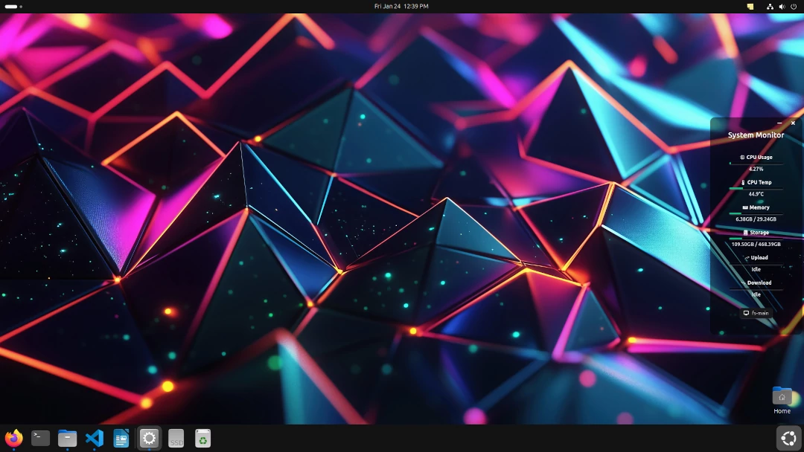

# A Simple UI Resource Monitor

## Built by @hmorlive mail@hazmedmoreno.com

This simple ui resource monitor has been built on Electron and is meant to be cross-plattform. It relies on system-information API and tracks:
- CPU load (%)
- CPU temp
- RAM used/total
- Storage used/total
- Network upload (Mbps)
- Network download (Mbps)

